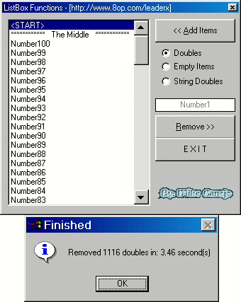



## Mike's ListBox Functions

### Description

This project I made shows you how to:    RemoveDoubles(Removes all strings found more than once in a listbox)  RemoveDoubleString(Removes a specified string found more then once in a listbox)  RemoveEmptyItems(Removes all empty items in a listbox)  These functions I made use VB's built-in listbox procedures(Not API), to remove strings fast from a listbox with 100% accuracy.  

-Mike Canejo-
 
### More Info
 
AIM: Mike3dd AOL: TheLeadX E-mail:Mike_3d@hotmail.com Website: Http://8op.com/leaderx

             |
---                |---
**Submitted On**   |2000-04-15 22:09:38
**By**             |[Michael L\. Canejo](https://github.com/Planet-Source-Code/PSCIndex/blob/master/ByAuthor/michael-l-canejo.md)
**Level**          |Intermediate
**User Rating**    |4.6 (37 globes from 8 users)
**Compatibility**  |VB 5\.0, VB 6\.0
**Category**       |[VB function enhancement](https://github.com/Planet-Source-Code/PSCIndex/blob/master/ByCategory/vb-function-enhancement__1-25.md)
**World**          |[Visual Basic](https://github.com/Planet-Source-Code/PSCIndex/blob/master/ByWorld/visual-basic.md)
**Archive File**   |[CODE\_UPLOAD48734162000\.zip](https://github.com/Planet-Source-Code/michael-l-canejo-mike-s-listbox-functions__1-7328/archive/master.zip)

